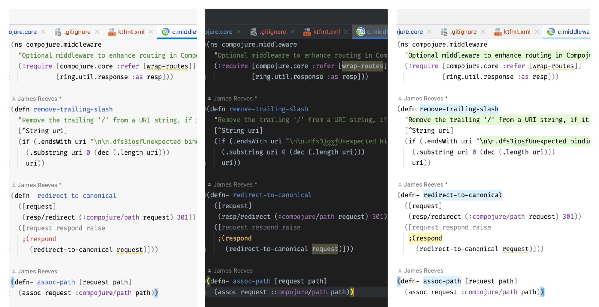

# Alabaster Themes

<!--  -->

<!-- ALL-CONTRIBUTORS-BADGE:START - Do not remove or modify this section -->

<!-- ALL-CONTRIBUTORS-BADGE:END -->

<!-- Plugin description -->
Light and dark minimal themes for Jetbrains IDEs based on [tonsky's sublime-scheme-alabaster](https://github.com/tonsky/sublime-scheme-alabaster). They highlight only:

- **Strings**
- **Constants**
- **Comments**
- **Function declarations**
<!-- Plugin description end -->

## Installation

- Using IDE built-in plugin system:

  <kbd>Settings/Preferences</kbd> > <kbd>Plugins</kbd> > <kbd>Marketplace</kbd> > <kbd>Search for "alabaster-themes"</kbd> >
  <kbd>Install Plugin</kbd>
- Manually:

  Download the [latest release](https://github.com/vlnabatov/alabaster-theme/releases) and install it manually using
  <kbd>Settings/Preferences</kbd> > <kbd>Plugins</kbd> > <kbd>⚙️</kbd> > <kbd>Install plugin from disk...</kbd>

## Contributors

<!-- ALL-CONTRIBUTORS-LIST:START - Do not remove or modify this section -->

<!-- prettier-ignore-start -->
<!-- markdownlint-disable -->
<table>
  <tbody>
    <tr>
      <td align="center" valign="top" width="14.28%"><a href="https://bitbucket.org/Lopinopulos"> <b>Nikolai Lopin</b></a> <a href="https://github.com/nabato/alabaster-themes/commits?author=nlopin" title="Code">💻</a></td>
    </tr>
  </tbody>
</table>

<!-- markdownlint-restore -->
<!-- prettier-ignore-end -->

<!-- ALL-CONTRIBUTORS-LIST:END -->
<!-- prettier-ignore-start -->

<!-- markdownlint-disable -->

<!-- markdownlint-restore -->

<!-- prettier-ignore-end -->

<!-- ALL-CONTRIBUTORS-LIST:END -->
